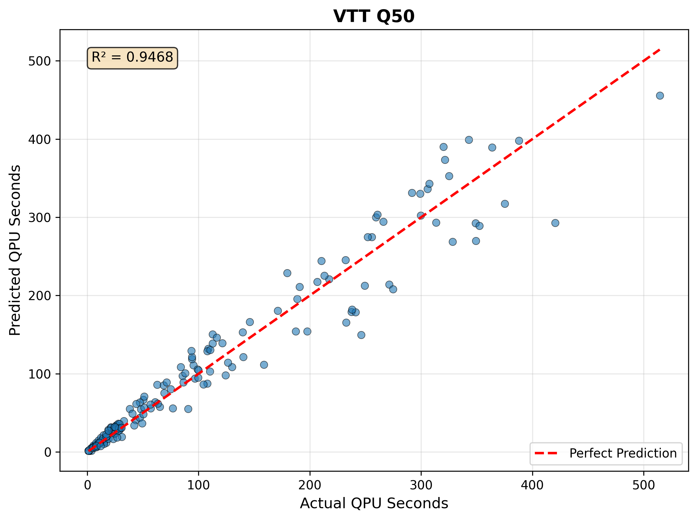
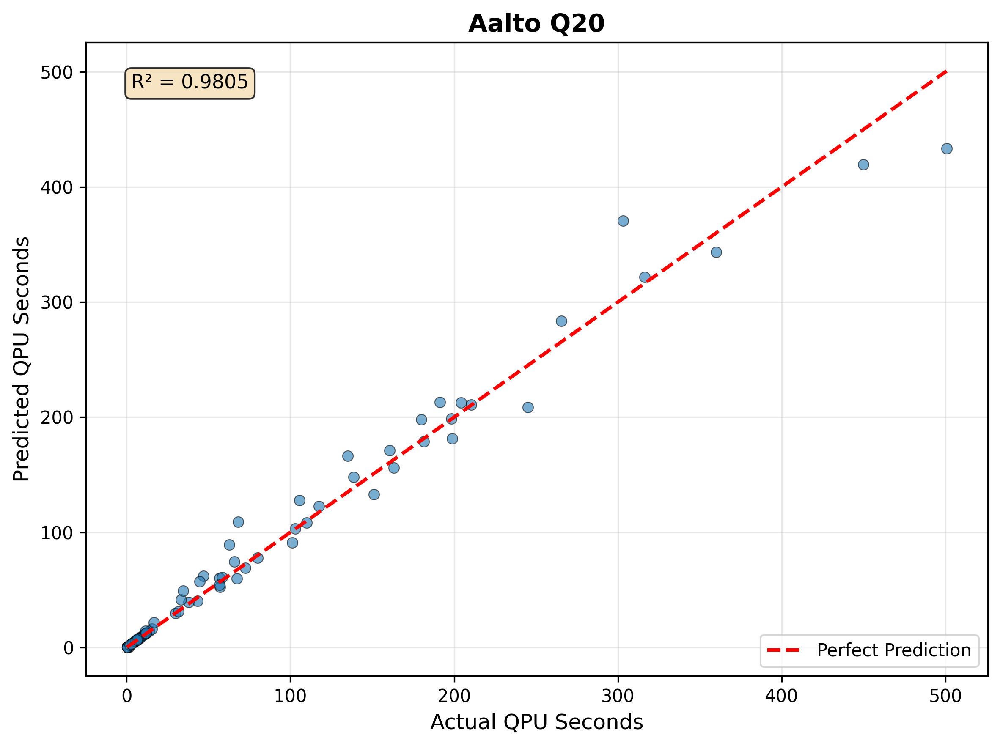

# How it works

Data is gathered by submitting quantum circuits with varying values for shots, depth, number of circuits in a batch and number of qubits. You can view the data gathered [here](https://github.com/FiQCI/resource-estimator/tree/main/data_analysis/data). QPU seconds is calculated from timestamps returned via IQM Client as explained [here](https://docs.meetiqm.com/iqm-client/integration_guide.html#job-phases-and-related-timestamps). QPU seconds is calculated as `execution_end` - `execution_start`.

The data is analyzed using different modeling approaches depending on the quantum computer:
- **VTT Q50**: Analytical model.
- **Aalto Q20**: Qubit-scaled analytical model (cross-validated R² = 0.98).

## VTT Q50

The model for VTT Q50 uses an **analytical model** that tries to capture the scaling of parameters:

$$T = T_{init} + \eta(B) \times B \times shots \times \alpha$$

Where:
- $T_{init} = ~0.88$ seconds (baseline overhead)
- $\eta(B) = ~0.986^{\min(B, 19)}$ (batching efficiency factor)
- $\alpha = ~0.000625$ (throughput coefficient)
- $B$ = number of circuits in a batch

Note that the circuit depth does not affect runtime by a noticeable amount. The number of qubits has a minimal impact.

In reality the initialization overhead ($T_{init}$) is approximately **1.1-1.2 seconds**.

## Aalto Q20

The model for Aalto Q20 uses a **qubit-scaled analytical model** that extends the standard analytical formula by making the throughput coefficient dependent on qubit count:

$$T = T_{init} + \eta(B) \times B \times shots \times (\alpha_{base} + \alpha_q \times qubits)$$

Where:
- $T_{init} \approx 0$ seconds (negligible baseline overhead)
- $\eta(B) = ~0.999^{\min(B, 3)} \approx 1$ (minimal batching efficiency decay)
- $\alpha_{base} = ~0.000295$ (base throughput coefficient per shot)
- $\alpha_q = ~1.37 \times 10^{-5}$ (per-qubit throughput scaling per shot)
- $B$ = number of circuits in a batch

Since $\eta(B) \approx 1$ in the observed batch range, the formula simplifies to approximately:

$$T \approx B \times shots \times (0.000295 + 1.37 \times 10^{-5} \times qubits)$$

This means each additional qubit adds roughly $1.37 \times 10^{-5}$ seconds per shot per circuit. Unlike VTT Q50, **qubit count has a measurable effect** on runtime for Aalto Q20. Circuit depth has negligible impact and is not included in the model.

The model was selected by comparing a plain analytical model (R² = 0.93), a degree-3 polynomial (cross-validated R² = 0.83, overfitting), and the qubit-scaled analytical model (cross-validated R² = 0.98). The qubit-scaled model gives the best generalisation with only 5 parameters.

## Limitations of the estimation

The model does not work well for circuits with a high depth (`>1000`) count, however, it is unrealistic to run such circuits on these devices.

## FAQ

- **What is the constant initialization time that is stated above?**

VTT Q50 has a constant initialization time associated with any quantum job submitted to it. For a batch of circuits, the constant initialization time applies to the whole batch (list of circuits). However, submitting many smaller batches of quantum circuits does apply this time. This is mostly due to the initialization of the control electronics needed before job submission.

- **Why does VTT Q50's model not include circuit depth or qubit count?**

The circuit depth and number of qubits has minimal impact on QPU execution time for VTT Q50. The runtime is largely dominated by the number of circuit executions (shots × batches). Removing these parameters from the VTT Q50 model simplifies the estimation without meaningfully affecting accuracy.

- **Why does Aalto Q20 include qubit count but not VTT Q50?**

Data from Aalto Q20 shows a measurable increase in per-shot execution time as qubit count grows. Each additional qubit adds approximately 1.37 × 10⁻⁵ seconds per shot per circuit, which becomes significant at high shot counts. VTT Q50 does not exhibit this behaviour to the same degree, so its model omits the qubit term.

- **Is the initialization time needed every time a parameter is updated in the quantum circuit?**

When running variational algorithms you often perform parameter updates outside of the quantum job. Therefore, for each parameter update the constant initialization time is added to the total runtime.
