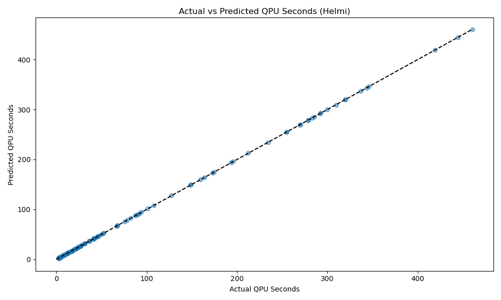
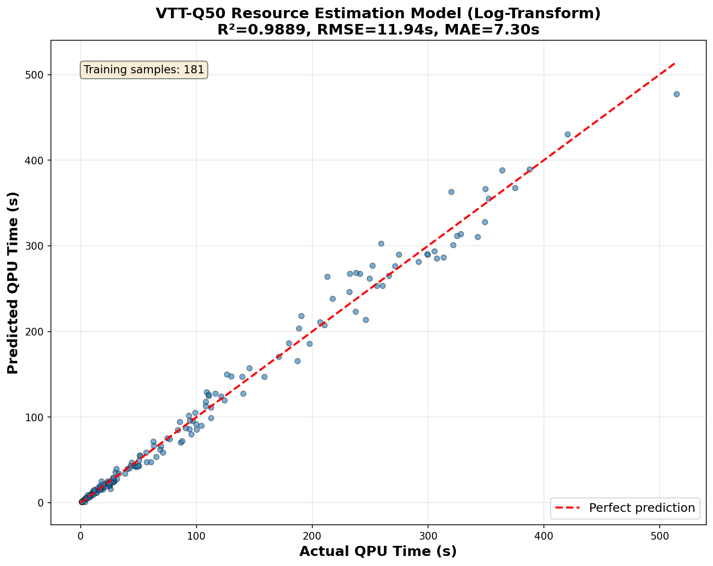

# How it works

Data is gathered by submitting quantum circuits with varying values for shots, depth, number of circuits in a batch and number of qubits. You can view the data gathered [here](). QPU seconds is calculated from timestamps returned via IQM Client as explained [here](https://docs.meetiqm.com/iqm-client/integration_guide.html#job-phases-and-related-timestamps). QPU seconds is calculated as `execution_end` - `execution_start`. 

The data gathered is analysed and a polynomial [`LinearRegression`](https://scikit-learn.org/stable/modules/generated/sklearn.linear_model.LinearRegression.html) model is created. This model is used when calculating the QPU seconds estimated. A separate model is created for each quantum computer. 

## Helmi

The QPUs equation for Helmi is given as

$$QPUs = 2.361885 + 0.432804 \times B \times kshots + 0.178790 \times qubits + ...$$

Where only the most significant terms are included. This shows that QPUs is strongly dependent on number of circuits in a batch and number of shots. The circuit depth plays little to no role in estimated QPUs. Helmi has weak dependence on number of qubits. 

Where $kshots = shots/1000$ and $B$ is number of circuits in a batch. 

## VTT Q50

$$QPUs = 3.687455 + 0.411647 \times B \times kshots + 0.039480 \times B + ...$$

VTT Q50 has larger constant initialisation time than Helmi. Runtime on Q50 is dependent on number of circuits in a batch and number of shots. The circuit depth plays little to no role in estimated QPUs. Increasing the number of qubits contributes very little to the overall runtime. 

## Limitations of the estimation 

The model does not work well for circuits with a high depth (`>1000`) count, however, it is unrealistic to run such circuits on these devices. 

## FAQ

- **What is the constant initialization time that is stated above?**

Both VTTQ50 and Helmi have a constant initialization time associated with any quantum job submitted to them. Therefore, when submitting a batch (list of circuits), the constant initialization time applies to the whole batch.However, submitting many smaller batches of quantum circuits does apply this time. This is mostly due to the initialization of the control electronics needed before job submission. 

- **Is the initialization time needed every time a parameter is updated in the quantum circuit?**

When running variational algorithms you often perform parameter updates outside of the quantum job. Therefore, for each parameter update the constant initialization time is added to the total runtime. 

