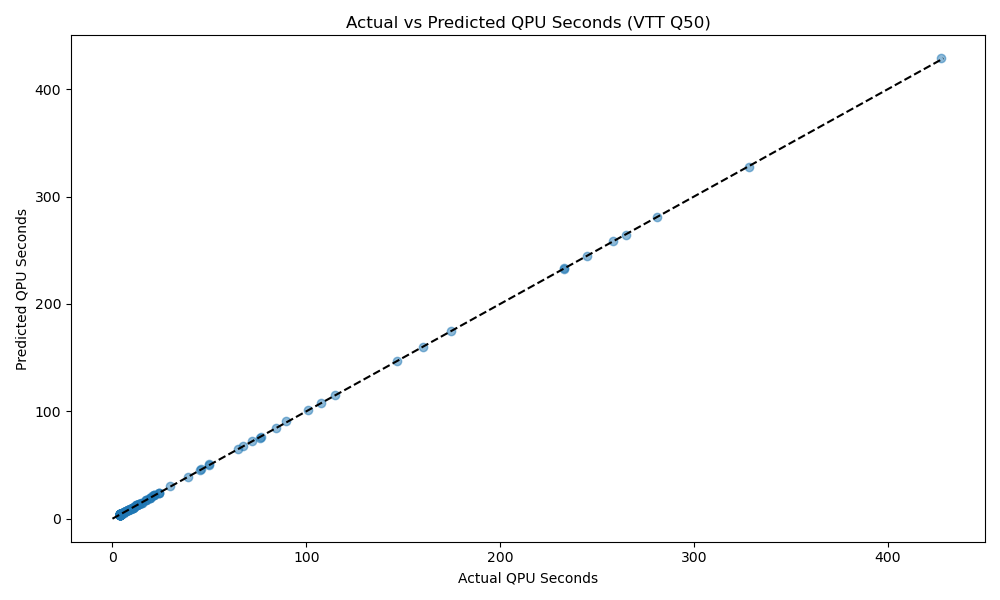

# How it works

Data is gathered by submitting quantum circuits with varying values for shots, depth, number of circuits in a batch and number of qubits. You can view the data gathered [here](https://github.com/FiQCI/resource-estimator/tree/main/data_analysis/data). QPU seconds is calculated from timestamps returned via IQM Client as explained [here](https://docs.meetiqm.com/iqm-client/integration_guide.html#job-phases-and-related-timestamps). QPU seconds is calculated as `execution_end` - `execution_start`.

The data is analyzed using **polynomial ridge regression models** implemented with scikit-learn's [`Ridge`](https://scikit-learn.org/stable/modules/generated/sklearn.linear_model.Ridge.html) and [`PolynomialFeatures`](https://scikit-learn.org/stable/modules/generated/sklearn.preprocessing.PolynomialFeatures.html). A separate model is created for each quantum computer:
- **Helmi**: Degree-2 polynomial
- **VTT Q50**: Degree-4 polynomial

## Helmi

The QPUs equation for Helmi is given as

$$QPUs = 2.361885 + 0.432804 \times B \times kshots + 0.178790 \times qubits + ...$$

Where only the most significant terms are included. This shows that QPUs is strongly dependent on number of circuits in a batch and number of shots. The circuit depth plays little to no role in estimated QPUs. Helmi has weak dependence on number of qubits.

Where $kshots = shots/1000$ and $B$ is number of circuits in a batch.

## VTT Q50

The model for VTT Q50 uses a **degree-4 polynomial regression**. The equation (showing only the most significant terms) is:

**VTT Q50 uses a model:**

$$T = T_{init} + \eta(B) \times B \times shots \times \alpha$$

Where:
- $T_{init} = ~0.88$ seconds (baseline overhead)
- $\eta(B) = ~0.986^{\min(B, 19)}$ (batching efficiency factor)
- $\alpha = ~0.000625$ (throughput coefficient)
- $B$ = number of circuits in a batch

Note that the circuit depth does not affect runtime by a noticeable amount. The number of qubits has a minimal impact.

The initialization overhead is approximately **1.1-1.2 seconds**.

## Limitations of the estimation

The model does not work well for circuits with a high depth (`>1000`) count, however, it is unrealistic to run such circuits on these devices.

## FAQ

- **What is the constant initialization time that is stated above?**

Both VTT Q50 and Helmi have a constant initialization time associated with any quantum job submitted to them. For a batch of circuits, the constant initialization time applies to the whole batch (list of circuits). However, submitting many smaller batches of quantum circuits does apply this time. This is mostly due to the initialization of the control electronics needed before job submission.

- **Why does VTT Q50's model not include circuit depth or qubit count?**

The circuit depth and number of qubits has minimal impact on QPU execution time. The runtime is largely dominated by the number of circuit executions (shots × batches) and qubit count. Removing depth from the VTT Q50 model simplifies the estimation model.

- **Is the initialization time needed every time a parameter is updated in the quantum circuit?**

When running variational algorithms you often perform parameter updates outside of the quantum job. Therefore, for each parameter update the constant initialization time is added to the total runtime.
